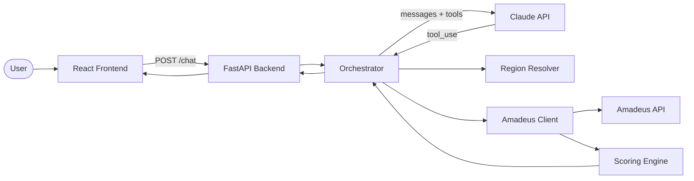

# ✈️ Flight Concierge

A conversational flight search tool. Tell it something like *"fly from NYC to somewhere warm in late June, under $400"* and it interprets your intent, asks clarifying questions if needed, searches the Amadeus flight API, scores results, and presents the top options. Powered by Claude (LLM-as-orchestrator) with tool use.

## Architecture



## Quick Start

### Prerequisites
- Python 3.11+
- Node.js 18+
- API keys: [Anthropic](https://console.anthropic.com/), [Amadeus](https://developers.amadeus.com/) (free test tier)

### Setup

```bash
# Clone
git clone https://github.com/boaz-ng/traveling-salesmen.git
cd traveling-salesmen

# Configure environment
cp .env.example .env
# Edit .env with your API keys

# Install dependencies
make install
```

### Run

```bash
# Terminal 1: Backend
make backend

# Terminal 2: Frontend
make frontend
```

Open http://localhost:5173 and start chatting.

### Test

```bash
make test
```

## Project Structure

```
├── README.md
├── .env.example
├── Makefile
├── backend/
│   ├── pyproject.toml
│   ├── app/
│   │   ├── main.py              # FastAPI entry point
│   │   ├── config.py            # Environment config
│   │   ├── session.py           # In-memory session store
│   │   ├── routers/chat.py      # POST /chat endpoint
│   │   ├── llm/
│   │   │   ├── orchestrator.py  # Claude conversation loop
│   │   │   ├── tools.py         # Tool definitions
│   │   │   └── prompts.py       # System prompt
│   │   ├── flights/
│   │   │   ├── amadeus_client.py
│   │   │   ├── scoring.py
│   │   │   └── regions.py
│   │   └── schemas/
│   │       ├── intent.py        # FlightSearchIntent (team contract)
│   │       ├── chat.py
│   │       └── flight.py
│   └── tests/
├── frontend/
│   ├── src/
│   │   ├── App.jsx
│   │   ├── api.js
│   │   └── components/
│   │       ├── ChatWindow.jsx
│   │       ├── MessageBubble.jsx
│   │       └── FlightCard.jsx
│   └── vite.config.js
└── docs/
    ├── ARCHITECTURE.md
    ├── CONTRIBUTING.md
    └── INTENT_SCHEMA.md
```

## Contributing

See [docs/CONTRIBUTING.md](docs/CONTRIBUTING.md) for setup instructions and guidelines.

## Current Status

- ✅ Project scaffold and architecture
- ✅ Backend: FastAPI + Claude orchestrator + Amadeus integration
- ✅ Frontend: React chat interface with flight cards
- ✅ Scoring engine with cost/comfort/balanced preferences
- ✅ Region-to-airport resolution
- ✅ Tests for scoring, regions, and Amadeus client
