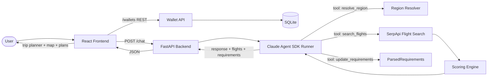

# Traveling Salesman

A conversational flight search tool with an interactive trip planner. Tell it something like *"fly from NYC to somewhere warm in late June, under $400"* and it interprets your intent, asks clarifying questions, searches for flights via SerpApi, scores results, and presents the top options on an interactive 2D/3D map.

Uses a **Claude Agent SDK** orchestration layer — the LLM decides the conversation flow, calls tools to resolve regions, search flights, and progressively update the UI with parsed requirements.

## Architecture



## Quick Start

### Prerequisites
- Python 3.11+
- Node.js 18+
- [Anthropic](https://console.anthropic.com/) API key
- [SerpApi](https://serpapi.com/) API key (free tier available)

### Setup

```bash
# Clone
git clone https://github.com/boaz-ng/traveling-salesmen.git
cd traveling-salesmen

# Configure environment
cp .env.example .env
# Edit .env with your API keys

# Install dependencies
make install
```

### Run

```bash
# Terminal 1: Backend
make backend

# Terminal 2: Frontend
make frontend
```

Open http://localhost:5173 and start chatting.

### Test

```bash
make test
```

## Project Structure

```
├── README.md
├── .env.example
├── Makefile
├── wallet.db                        # SQLite database (auto-created on first run)
├── backend/
│   ├── pyproject.toml
│   ├── app/
│   │   ├── main.py                  # FastAPI entry point + lifespan (DB init)
│   │   ├── config.py                # Environment config (pydantic-settings)
│   │   ├── session.py               # In-memory chat session store
│   │   ├── db.py                    # SQLite database layer (wallets + flights)
│   │   ├── routers/
│   │   │   ├── chat.py              # POST /chat endpoint
│   │   │   └── wallet.py            # /wallets REST endpoints (trips)
│   │   ├── llm/
│   │   │   ├── agent_runner.py      # Claude Agent SDK runner
│   │   │   ├── orchestrator.py      # Legacy provider factory
│   │   │   ├── provider.py          # Tool handler + LLMProvider base
│   │   │   ├── anthropic_provider.py # Direct Anthropic API provider
│   │   │   ├── qwen_provider.py     # Qwen (OpenAI-compatible) provider
│   │   │   ├── tools.py             # Tool definitions (schemas)
│   │   │   └── prompts.py           # System prompt
│   │   ├── flights/
│   │   │   ├── serpapi_client.py    # SerpApi flight search
│   │   │   ├── scoring.py          # Weighted scoring engine
│   │   │   └── regions.py          # Region → airport resolution
│   │   └── schemas/
│   │       ├── intent.py            # FlightSearchIntent (contract)
│   │       ├── chat.py              # ChatRequest, ChatResponse, ParsedRequirements
│   │       ├── flight.py            # FlightOption, FlightSegment
│   │       └── wallet.py            # Wallet/trip Pydantic models
│   └── tests/
├── frontend/
│   ├── vite.config.js
│   ├── src/
│   │   ├── App.jsx                  # Main app: layout, state, trip/wallet management
│   │   ├── api.js                   # Backend API client (chat + trip endpoints)
│   │   └── components/
│   │       ├── ChatWindow.jsx       # Chat panel with message history
│   │       ├── MessageBubble.jsx    # Individual message rendering
│   │       ├── FlightCard.jsx       # Flight result card
│   │       ├── TripPlannerLayout.jsx    # Trip planner orchestrator
│   │       ├── RequirementsStrip.jsx    # Requirement pills (origin, dates, etc.)
│   │       ├── DestinationRegionMap.jsx # 2D map with route visualization
│   │       ├── PlansSection.jsx     # Plan cards container with pagination
│   │       ├── PlanCard.jsx         # Individual plan with expandable details + "Add to Trip"
│   │       └── TripSection.jsx      # Shared trip: saved flights comparison + share link
│   └── data/
│       └── airport_coordinates/
│           └── airportCoordinates.js
└── docs/
    ├── ARCHITECTURE.md
    ├── CONTRIBUTING.md
    └── INTENT_SCHEMA.md
```

## Features

### Chat + Flight Search
- **Split-screen chat**: toggleable chat panel (right half on desktop, full screen on mobile)
- **Bottom input bar**: quick message input when chat is collapsed
- **Natural language flight search**: describe your trip and the agent finds flights
- **Progressive updates**: requirements and map update in real-time as the conversation progresses

### Trip Planner
- **Requirements strip**: pills showing parsed trip details (origin, destination, dates, budget)
- **Interactive map**: 2D flat map (equirectangular) with route visualization
- **Flight plans**: ranked plan cards with expandable details and route highlighting on map
- **Pagination**: shows top 2 flights first with "Show more" to cycle through results

### Collaborative Trips
- **Add to Trip**: save any flight to a persistent trip (backed by SQLite)
- **Duplicate detection**: can't add the same flight twice; button shows "Added" with a checkmark
- **Shareable link**: click "Share trip" to copy a URL (e.g. `?trip=abc123`) to your clipboard
- **Collaborative**: anyone with the link can open it, see all saved flights, and add their own
- **Attribution**: each saved flight shows who added it and optional notes
- **Display name**: prompted once on first save, stored in localStorage

## Environment Variables

| Variable | Required | Description |
|---|---|---|
| `LLM_PROVIDER` | No | `anthropic` (default) or `qwen` |
| `ANTHROPIC_API_KEY` | Yes | Anthropic API key from [console.anthropic.com](https://console.anthropic.com) |
| `SERPAPI_API_KEY` | Yes | SerpApi key from [serpapi.com](https://serpapi.com) |
| `QWEN_API_KEY` | No | Only if using `LLM_PROVIDER=qwen` |
| `QWEN_BASE_URL` | No | Custom Qwen endpoint URL |

The `.env` file goes in the **project root** (the folder containing `backend/` and `frontend/`).

## Troubleshooting

**"I couldn't complete that request" / Claude CLI exit code 1:**
1. Verify `ANTHROPIC_API_KEY` is set correctly in `.env` and has credits.
2. Ensure the Claude Code CLI is installed: `npm install -g @anthropic-ai/claude-code`
3. Check that `claude -v` works in your terminal.
4. Restart the backend after any `.env` changes: `Ctrl+C` then `make backend`.

**Frontend shows blank / 404:**
- Make sure both the backend (`make backend`) and frontend (`make frontend`) are running.
- Open http://localhost:5173 (not port 8000).

## Contributing

See [docs/CONTRIBUTING.md](docs/CONTRIBUTING.md) for setup instructions and guidelines.

## Current Status

- ✅ Project scaffold and architecture
- ✅ Backend: FastAPI + Claude Agent SDK + SerpApi integration
- ✅ Progressive requirements parsing (update_requirements tool)
- ✅ Frontend: split-screen chat + trip planner with interactive maps
- ✅ 2D equirectangular map with seamless horizontal panning
- ✅ 3D globe with drag-to-rotate and zoom-scaled sensitivity
- ✅ Multi-segment flight routes with layover visualization
- ✅ Scoring engine with cost/comfort/balanced preferences
- ✅ Region-to-airport resolution
- ✅ Tests for scoring, regions, client, and provider abstraction

