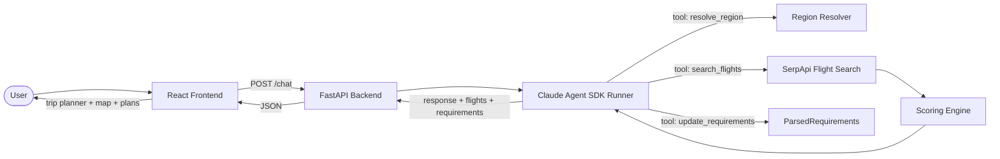

# Traveling Salesmen

A conversational flight search tool with an interactive trip planner. Tell it something like *"fly from NYC to somewhere warm in late June, under $400"* and it interprets your intent, asks clarifying questions, searches for flights via SerpApi, scores results, and presents the top options on an interactive 2D/3D map.

Uses a **Claude Agent SDK** orchestration layer — the LLM decides the conversation flow, calls tools to resolve regions, search flights, and progressively update the UI with parsed requirements.

## Architecture



## Quick Start

### Prerequisites
- Python 3.11+
- Node.js 18+
- [Anthropic](https://console.anthropic.com/) API key
- [SerpApi](https://serpapi.com/) API key (free tier available)

### Setup

```bash
# Clone
git clone https://github.com/boaz-ng/traveling-salesmen.git
cd traveling-salesmen

# Configure environment
cp .env.example .env
# Edit .env with your API keys

# Install dependencies
make install
```

### Run

```bash
# Terminal 1: Backend
make backend

# Terminal 2: Frontend
make frontend
```

Open http://localhost:5173 and start chatting.

### Test

```bash
make test
```

## Project Structure

```
├── README.md
├── .env.example
├── Makefile
├── backend/
│   ├── pyproject.toml
│   ├── app/
│   │   ├── main.py                # FastAPI entry point
│   │   ├── config.py              # Environment config (pydantic-settings)
│   │   ├── session.py             # In-memory session store
│   │   ├── routers/chat.py        # POST /chat endpoint
│   │   ├── llm/
│   │   │   ├── agent_runner.py    # Claude Agent SDK runner
│   │   │   ├── orchestrator.py    # Legacy provider factory
│   │   │   ├── provider.py        # Tool handler + LLMProvider base
│   │   │   ├── tools.py           # Tool definitions (schemas)
│   │   │   └── prompts.py         # System prompt
│   │   ├── flights/
│   │   │   ├── amadeus_client.py  # SerpApi flight search
│   │   │   ├── scoring.py         # Weighted scoring engine
│   │   │   └── regions.py         # Region → airport resolution
│   │   └── schemas/
│   │       ├── intent.py          # FlightSearchIntent (contract)
│   │       ├── chat.py            # ChatRequest, ChatResponse, ParsedRequirements
│   │       └── flight.py          # FlightOption, FlightSegment
│   └── tests/
├── frontend/
│   ├── src/
│   │   ├── App.jsx                # Main app: layout, state, split-screen chat
│   │   ├── api.js                 # Backend API client
│   │   └── components/
│   │       ├── ChatWindow.jsx     # Chat panel with message history
│   │       ├── MessageBubble.jsx  # Individual message rendering
│   │       ├── FlightCard.jsx     # Flight result card in chat
│   │       ├── TripPlannerLayout.jsx  # Trip planner orchestrator
│   │       ├── RequirementsStrip.jsx  # Requirement pills (origin, dates, etc.)
│   │       ├── DestinationRegionMap.jsx  # 2D map + 3D globe
│   │       ├── PlansSection.jsx   # Plan cards container
│   │       └── PlanCard.jsx       # Individual plan with expandable details
│   └── vite.config.js
└── docs/
    ├── ARCHITECTURE.md
    ├── CONTRIBUTING.md
    └── INTENT_SCHEMA.md
```

## Frontend Features

- **Split-screen chat**: toggleable chat panel (right half on desktop, full screen on mobile)
- **Bottom input bar**: quick message input when chat is collapsed, with chat icon to expand
- **Requirements strip**: pills showing parsed trip details (origin, destination, dates, budget)
- **Interactive map**: 2D flat map (equirectangular) with infinite horizontal scrolling, or 3D globe with drag-to-rotate
- **Flight plans**: ranked plan cards with expandable details, layover visualization, and route highlighting on map
- **Progressive updates**: requirements and map update in real-time as the conversation progresses

## Contributing

See [docs/CONTRIBUTING.md](docs/CONTRIBUTING.md) for setup instructions and guidelines.

## Current Status

- ✅ Project scaffold and architecture
- ✅ Backend: FastAPI + Claude Agent SDK + SerpApi integration
- ✅ Progressive requirements parsing (update_requirements tool)
- ✅ Frontend: split-screen chat + trip planner with interactive maps
- ✅ 2D equirectangular map with seamless horizontal panning
- ✅ 3D globe with drag-to-rotate and zoom-scaled sensitivity
- ✅ Multi-segment flight routes with layover visualization
- ✅ Scoring engine with cost/comfort/balanced preferences
- ✅ Region-to-airport resolution
- ✅ Tests for scoring, regions, client, and provider abstraction
