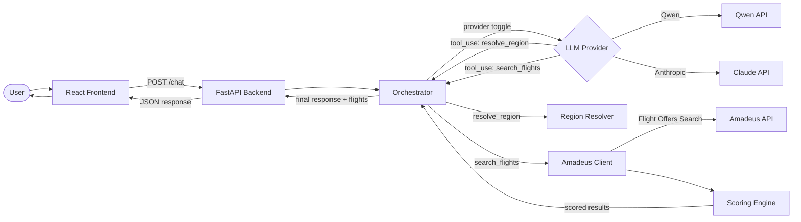

# Architecture

## Overview

Traveling Salesmen uses an **LLM-as-orchestrator** architecture with **pluggable LLM providers**. The active provider (Qwen or Anthropic Claude) drives the conversation loop — it decides when it has enough information to search and calls tools directly. The provider is selected via the `LLM_PROVIDER` environment variable.

## Data Flow



## Components

### Frontend (React + Vite + Tailwind)
- Simple chat interface with message bubbles
- Flight cards rendered when search results are returned
- Connects to backend at `http://localhost:8000`

### Backend (FastAPI + Python)

#### API Layer (`routers/chat.py`)
- Single `POST /chat` endpoint
- Manages session lifecycle
- Delegates to the orchestrator

#### Orchestrator (`llm/orchestrator.py`)
- Provider factory: selects `QwenProvider` or `AnthropicProvider` based on `LLM_PROVIDER` env var
- Delegates conversation loop to the active provider
- Provider is cached after first creation

#### LLM Provider Abstraction (`llm/provider.py`)
- `LLMProvider` abstract base class with `run_conversation()` method
- Shared `handle_tool_call()` function used by all providers
- Adding a new provider means implementing one class

#### Provider: Qwen (`llm/qwen_provider.py`)
- Uses the OpenAI-compatible SDK (`openai` package)
- Connects to DashScope API (configurable base URL)
- Default model: `qwen-plus`

#### Provider: Anthropic (`llm/anthropic_provider.py`)
- Uses the Anthropic SDK (`anthropic` package)
- Default model: `claude-sonnet-4-20250514`

#### Tool Definitions (`llm/tools.py`)
- Single source of truth for tool schemas
- Exports both `ANTHROPIC_TOOLS` (Claude format) and `OPENAI_TOOLS` (OpenAI format)
- `resolve_region`: resolves vague region names to IATA codes
- `search_flights`: searches flights with structured parameters

#### Flight Search (`flights/`)
- `regions.py`: Dict-based region → airport code resolution
- `amadeus_client.py`: Amadeus API wrapper using the official SDK
- `scoring.py`: Weighted scoring/ranking of flight options

#### Schemas (`schemas/`)
- `intent.py`: `FlightSearchIntent` — the contract between LLM and search
- `chat.py`: Request/response models for the chat API
- `flight.py`: `FlightOption` and `FlightSegment` models

#### Session Management (`session.py`)
- In-memory dict of session_id → message history
- UUID generation for new sessions
- Throwaway — persistence planned for later

## Key Design Decisions

1. **Pluggable LLM providers**: Toggle via `LLM_PROVIDER` env var; easy to add new providers
2. **LLM-as-orchestrator**: The LLM decides the conversation flow, not hardcoded logic
3. **FlightSearchIntent as contract**: Clean separation between intent interpretation and flight search
4. **Dict-based region mapping**: Easily extensible without code changes
5. **Weighted scoring**: User preference (cost/comfort/balanced) adjusts scoring weights
6. **In-memory sessions**: Simplest possible state for MVP
7. **Modular team ownership**: Each module has scoped tests, lint, and clear interface contracts

## Module Boundaries (Team Ownership)

The codebase is designed for 4 people to work independently:

```
┌─────────────────────────────────────────────────────────┐
│  Frontend (Person 1)                                    │
│  frontend/src/                                          │
│  ─── POST /chat JSON contract ───────────────────┐      │
└──────────────────────────────────────────────────┼──────┘
                                                   │
┌──────────────────────────────────────────────────┼──────┐
│  API / Integration (Person 4)                    │      │
│  routers/chat.py, main.py, session.py, config.py │      │
│  ─── run_conversation() signature ───────────┐   │      │
└──────────────────────────────────────────────┼───┘──────┘
                                               │
┌──────────────────────────────────────────────┼──────────┐
│  LLM / Orchestration (Person 2)              │          │
│  llm/orchestrator.py, provider.py, *_provider.py        │
│  llm/tools.py, llm/prompts.py                          │
│  ─── handle_tool_call() ─────────────────┐              │
└──────────────────────────────────────────┼──────────────┘
                                           │
┌──────────────────────────────────────────┼──────────────┐
│  Flight Search / Data (Person 3)         │              │
│  flights/amadeus_client.py, scoring.py, regions.py      │
│  schemas/intent.py, flight.py, chat.py                  │
└─────────────────────────────────────────────────────────┘
```

**Interfaces between modules:**

| Seam | Contract | Tested in |
|------|----------|-----------|
| Frontend ↔ API | `ChatRequest` / `ChatResponse` JSON shape | `test_chat_api.py` |
| API ↔ Orchestrator | `run_conversation(messages) → (str, list[FlightOption] \| None)` | `test_contracts.py` |
| LLM ↔ Flights | `handle_tool_call(name, input) → (json_str, flights)` | `test_contracts.py` |
| LLM ↔ Schemas | Tool schema params ⊇ FlightSearchIntent fields | `test_contracts.py` |
| Flights ↔ Schemas | `score_flights()` returns valid `FlightOption` objects | `test_contracts.py` |

Each team member runs `make test-<module>` for fast iteration and `make test-contracts` before merging.

## Adding a New LLM Provider

1. Create `backend/app/llm/your_provider.py` implementing `LLMProvider`
2. Add any new config fields to `backend/app/config.py`
3. Register it in the factory in `backend/app/llm/orchestrator.py`
4. If the provider uses a non-standard tool format, add it to `backend/app/llm/tools.py`
