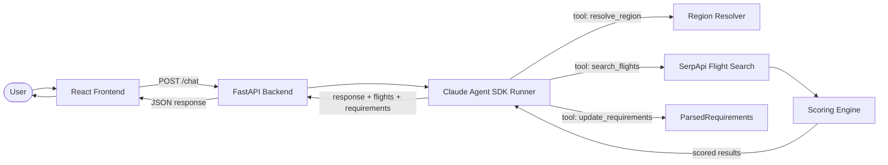

# Architecture

## Overview

Traveling Salesmen uses a **Claude Agent SDK** orchestration layer. The agent drives the conversation — it decides when it has enough information to search, calls tools to resolve regions, search flights via SerpApi, and progressively updates the frontend with its parsed understanding of the user's requirements.

## Data Flow



## Components

### Frontend (React + Vite + Tailwind)

The frontend is a single-page app with a split-screen layout:

- **App.jsx**: Main layout — manages session state, requirements, flight plans, and the split-screen chat toggle. Derives display models (`plans`, `regionSummary`) from raw flight data.
- **ChatWindow.jsx**: Scrollable chat panel with message history. Supports external message injection via `pendingMessage` prop (from the bottom input bar). Always mounted to preserve state when hidden.
- **TripPlannerLayout.jsx**: Orchestrates the three main content sections.
- **RequirementsStrip.jsx**: Pill-shaped cards showing parsed requirements (origin, destination, dates, budget, preference). Updates progressively as the user converses.
- **DestinationRegionMap.jsx**: Interactive map with two modes:
  - **2D map**: Equirectangular projection with triple-copy rendering for seamless horizontal panning. Zoom-scaled labels, markers, and route lines.
  - **3D globe**: Orthographic projection with drag-to-rotate (sensitivity scales with zoom). Great circle arcs for flight routes.
- **PlansSection.jsx / PlanCard.jsx**: Ranked flight plans with expandable details, layover visualization, and route labels.
- **Bottom input bar**: Fixed bar with chat icon + text input + send button, visible when chat panel is collapsed. Submitting opens the chat and sends the message.

Connects to backend via Vite proxy at `/chat` (no direct cross-origin requests).

### Backend (FastAPI + Python)

#### API Layer (`routers/chat.py`)
- Single `POST /chat` endpoint
- Manages session lifecycle (in-memory)
- Delegates to `run_agent_session` from the agent runner
- Returns `ChatResponse` with `response`, `flights`, and `parsed_intent`

#### Agent Runner (`llm/agent_runner.py`)
- Wires the **Claude Agent SDK** to the domain logic
- Defines three MCP tools via `@tool` decorators:
  - `resolve_region`: resolves vague region names to IATA airport codes
  - `search_flights`: searches flights with structured parameters via SerpApi
  - `update_requirements`: captures the agent's current understanding of trip details as `ParsedRequirements`
- Creates an MCP server with all tools registered
- `run_agent_session()` takes a message history and returns `(assistant_text, flights_or_none, parsed_requirements_or_none)`

#### Tool Definitions (`llm/tools.py`)
- Single source of truth for tool schemas (descriptions + JSON Schema parameters)
- Exports schema constants used by the agent runner

#### System Prompt (`llm/prompts.py`)
- Instructs the agent to always call `update_requirements` with its current understanding
- Guides conversational flow: ask clarifying questions, then search when ready

#### Flight Search (`flights/`)
- `regions.py`: Dict-based region → airport code resolution
- `amadeus_client.py`: SerpApi flight search wrapper
- `scoring.py`: Weighted scoring/ranking of flight options (cost/comfort/balanced)

#### Schemas (`schemas/`)
- `intent.py`: `FlightSearchIntent` — contract between LLM tools and flight search
- `chat.py`: `ChatRequest`, `ChatResponse`, `ParsedRequirements`
- `flight.py`: `FlightOption` and `FlightSegment` models

#### Session Management (`session.py`)
- In-memory dict of session_id → message history
- UUID generation for new sessions

## Key Design Decisions

1. **Claude Agent SDK**: Single LLM provider via the agent SDK, replacing the earlier pluggable provider pattern
2. **LLM-as-orchestrator**: The agent decides the conversation flow, not hardcoded logic
3. **Progressive requirements**: The `update_requirements` tool lets the agent push structured data to the frontend after every turn
4. **SerpApi for flights**: Real flight search via Google Flights data through SerpApi
5. **FlightSearchIntent as contract**: Clean separation between intent interpretation and flight search
6. **Always-mounted chat**: Chat panel stays in the DOM when hidden, preserving state and in-flight requests
7. **Zoom-invariant rendering**: 2D map labels, markers, and lines scale inversely with zoom for consistent visual size
8. **In-memory sessions**: Simplest possible state for MVP

## Module Boundaries (Team Ownership)

```
┌─────────────────────────────────────────────────────────┐
│  Frontend (Person 1)                                    │
│  frontend/src/                                          │
│  ─── POST /chat JSON contract ───────────────────┐      │
└──────────────────────────────────────────────────┼──────┘
                                                   │
┌──────────────────────────────────────────────────┼──────┐
│  API / Integration (Person 4)                    │      │
│  routers/chat.py, main.py, session.py, config.py │      │
│  ─── run_agent_session() signature ─────────┐    │      │
└──────────────────────────────────────────────┼───┘──────┘
                                               │
┌──────────────────────────────────────────────┼──────────┐
│  LLM / Orchestration (Person 2)              │          │
│  llm/agent_runner.py, provider.py                       │
│  llm/tools.py, llm/prompts.py                          │
│  ─── handle_tool_call() ─────────────────┐              │
└──────────────────────────────────────────┼──────────────┘
                                           │
┌──────────────────────────────────────────┼──────────────┐
│  Flight Search / Data (Person 3)         │              │
│  flights/amadeus_client.py, scoring.py, regions.py      │
│  schemas/intent.py, flight.py, chat.py                  │
└─────────────────────────────────────────────────────────┘
```

**Interfaces between modules:**

| Seam | Contract | Tested in |
|------|----------|-----------|
| Frontend ↔ API | `ChatRequest` / `ChatResponse` JSON shape | `test_chat_api.py` |
| API ↔ Agent Runner | `run_agent_session(messages) → (str, list[FlightOption] \| None, ParsedRequirements \| None)` | `test_contracts.py` |
| Agent ↔ Flights | `handle_tool_call(name, input) → (json_str, flights)` | `test_contracts.py` |
| Agent ↔ Schemas | Tool schema params ⊇ FlightSearchIntent fields | `test_contracts.py` |
| Flights ↔ Schemas | `score_flights()` returns valid `FlightOption` objects | `test_contracts.py` |

Each team member runs `make test-<module>` for fast iteration and `make test-contracts` before merging.

## Adding a New Tool

1. Define the tool description and JSON Schema parameters in `backend/app/llm/tools.py`
2. Create an `@tool`-decorated async function in `backend/app/llm/agent_runner.py`
3. Register the tool in the `flight_tools_server` tools list
4. If the tool produces data for the frontend, add a field to `ChatResponse` in `schemas/chat.py`
