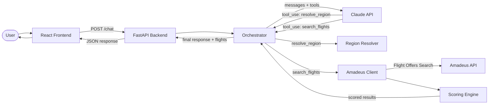

# Architecture

## Overview

Flight Concierge uses an **LLM-as-orchestrator** architecture. Claude API with tool use drives the conversation loop — it decides when it has enough information to search and calls tools directly.

## Data Flow

## Components

### Frontend (React + Vite + Tailwind)
- Simple chat interface with message bubbles
- Flight cards rendered when search results are returned
- Connects to backend at `http://localhost:8000`

### Backend (FastAPI + Python)

#### API Layer (`routers/chat.py`)
- Single `POST /chat` endpoint
- Manages session lifecycle
- Delegates to the orchestrator

#### Orchestrator (`llm/orchestrator.py`)
- Manages the Claude API conversation loop
- Sends message history + tool definitions to Claude
- Handles tool calls (resolve_region, search_flights) in a loop
- Returns final text response + any flight results

#### Tool Definitions (`llm/tools.py`)
- JSON schemas for Claude's tool use format
- `resolve_region`: resolves vague region names to IATA codes
- `search_flights`: searches flights with structured parameters

#### Flight Search (`flights/`)
- `regions.py`: Dict-based region → airport code resolution
- `amadeus_client.py`: Amadeus API wrapper using the official SDK
- `scoring.py`: Weighted scoring/ranking of flight options

#### Schemas (`schemas/`)
- `intent.py`: `FlightSearchIntent` — the contract between LLM and search
- `chat.py`: Request/response models for the chat API
- `flight.py`: `FlightOption` and `FlightSegment` models

#### Session Management (`session.py`)
- In-memory dict of session_id → message history
- UUID generation for new sessions
- Throwaway — persistence planned for later

## Key Design Decisions

1. **LLM-as-orchestrator**: Claude decides the conversation flow, not hardcoded logic
2. **FlightSearchIntent as contract**: Clean separation between intent interpretation and flight search
3. **Dict-based region mapping**: Easily extensible without code changes
4. **Weighted scoring**: User preference (cost/comfort/balanced) adjusts scoring weights
5. **In-memory sessions**: Simplest possible state for MVP
